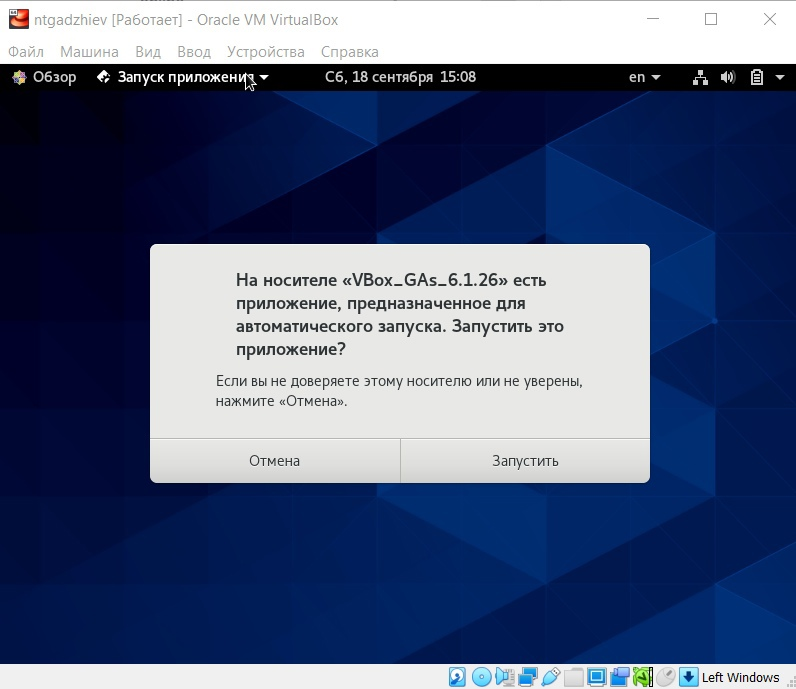

---
## Front matter
lang: ru-RU
title:  Презентация по Установке и конфигурации операционной системы на виртуальную машину
author: |
	Гаджиев Нурсултан \inst{1}
	
institute: |
	\inst{1}RUDN, Moscow, Russia
	
date: 2021 Moscow, Russia

## Formatting
toc: false
slide_level: 2
theme: metropolis
header-includes: 
 - \metroset{progressbar=frametitle,sectionpage=progressbar,numbering=fraction}
 - '\makeatletter'
 - '\beamer@ignorenonframefalse'
 - '\makeatother'
aspectratio: 43
section-titles: true
---

# Цель работы

## цель работы

Приобретение практических навыков установки операционной системы на виртуальную машину, настройки минимально необходимых для дальнейшей работы сервисов.

# Задание

## Задание

1. Нужно было установить и конфигурировать операционную систему на виртуальную машину.

2. Сделать подключение образа диска дополнительным гостевым OC.

## Результаты

Я вошёл в систему.

## Результаты

Занялся подключением образа диска Дополненым гостевым OC. (рис. -@fig:001)

{ #fig:001 width=70% }

## Вывод

Приобрел практические навыки установки операционной системы на виртуальную машину, также научился настраивать минимально необходимое для дальнейшей работы сервисов.

## {.standout}

Благодарю за уделенное время!
